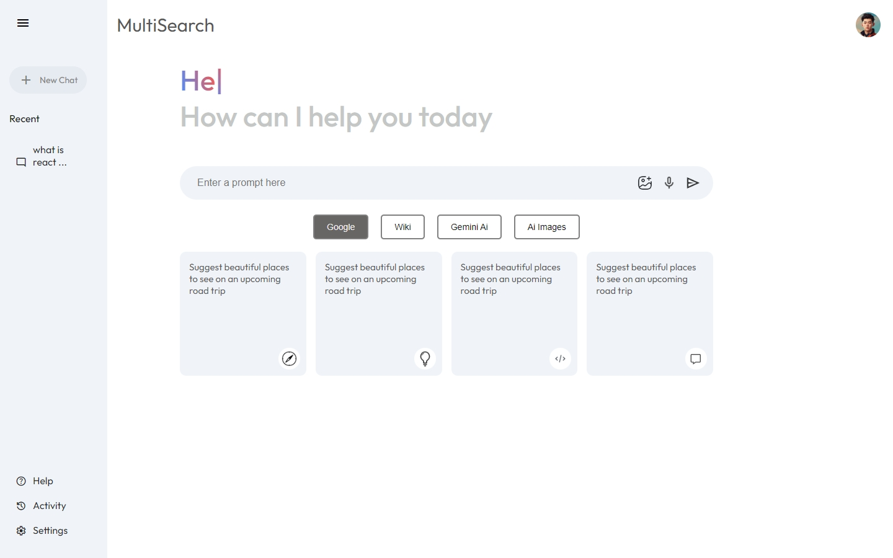
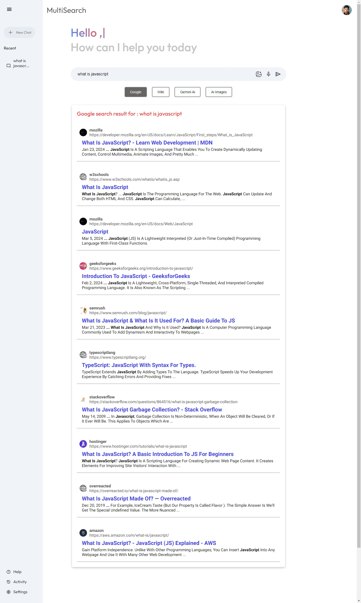
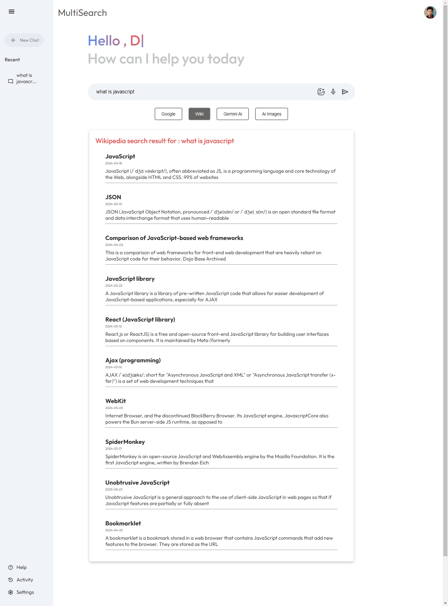
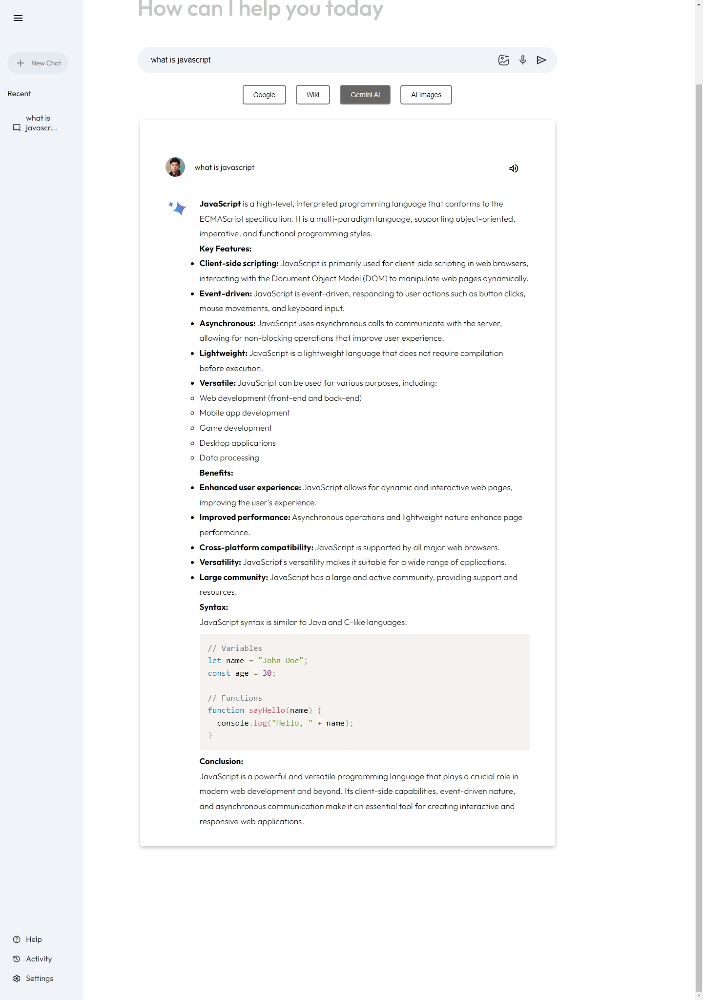
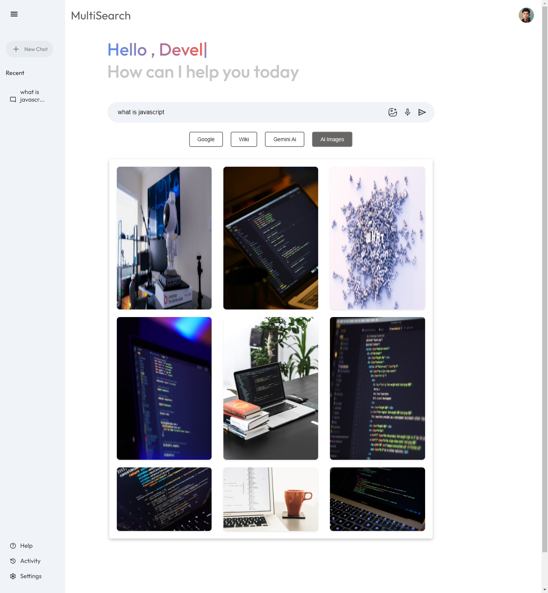

# MultiSearch Engine

[Hosted Link]()

This project is a multi-search engine where users can input their queries and search across various platforms. It incorporates Google Custom Search API for web search, Wikipedia API for encyclopedic information, Gemini API for news, and Unsplash API for image search.

## Project Overview

The application allows users to input their search query and choose between different search options. It also includes additional features like image search, speech recognition for input, and text-to-speech for query results.

## Technologies Used
 HTML, CSS, JavaScript

## Difficulty Faced
Working with APIs posed a challenge, especially in handling asynchronous requests and parsing the received data. Implementing storage for search history required managing local storage efficiently to maintain user data across sessions.

## Additional Features
-**Image Search**: Users can search for images related to their queries using the Unsplash API.

-**Speech Recognition**: Implemented speech recognition functionality to allow users to input queries verbally.

-**Text-to-Speech**: Converted search results into speech format using text-to-speech functionality for accessibility.

## Installation
1. Clone the repository: `https://github.com/Ibrahim1249/Geekathon_M4.git`
2. Open `index.html` in your browser.

## Screenshots

## Contributing
I welcome contributions to improve MultiSearch Engine! Please fork this repository and submit a pull request with your changes.